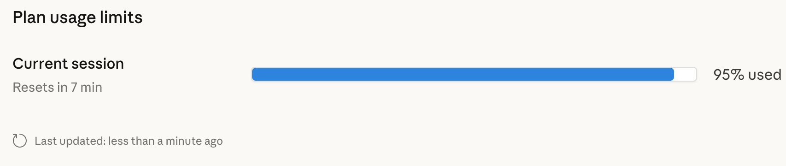

# Claude Usage Limits



As of November of 2025, Claude has a token usage limit for every 5-hour window.
If you go over your token limit in that 5-hour window, Claude will pause its work.
Claude works hard not to lose progress on tasks when it pauses, but it can happen.

Creating Intelligent Textbooks take a lot of tokens.  To generate a 500-page textbook with hundreds of infographics, charts and micro-simulations typically can use about 100 hours of tokens.  However, there are ways you can
optimize your limits.

My suggestion is to spread your work around the day.  Start early and when you run out of tokens, take a break.
The five-hour windows typically fall in to four regions:

1. morning tasks 8am to 1pm
2. afternoon tasks from 1pm to 6pm
3. evening tasks starting at 7pm
4. late night task only if I am awake at midnight

!!! Note
    Running a huge task like generating 100 FAQs should be done just before you go to bed.

## Claude Continue

You can start claude with the `--continue` option to resume a task.

## Usage Command

/usage

```
Settings:  Status   Config   Usage   (tab to cycle)

 Current session
 ██                                                 4% used
 Resets 3pm (America/Chicago)

 Esc to exit
```

## Sample Usage

You can also ask Claude how many tokens a task took.

!!! prompt
    How many tokens did this task take?

Looking at the token usage tracking throughout the conversation:

  Total tokens used: 59,374 out of 200,000 budget

  Breaking it down:
  - Initial setup (loading skill, reading course description): ~19,325 tokens
  - Glossary generation task: ~40,049 tokens
    - Reading and validating concept list
    - Generating 200 ISO 11179-compliant definitions with examples
    - Writing the complete glossary.md file
    - Creating the quality report

  Efficiency stats:
  - Used ~30% of available token budget
  - Generated definitions for 200 concepts with 100% example coverage
  - Remaining budget: 140,626 tokens

  The task was quite efficient considering it produced:
  - A 1,192-line glossary file with comprehensive definitions
  - A detailed quality assessment report
  - Full validation and quality scoring

  This is well within the token budget, leaving plenty of capacity for additional glossary
  refinements or related tasks if needed!

|Task Name |Step|Skill Name|Tokens|Percent of 200K Total|
|----------|------|---------------------|
|Check Course Description for Quality|1|analyze-course-description|10K|5%|
|Generate Learning Graph|2|learning-graph-generator|30K|15%|
|Generate Book Chapters|3|book-chapter-generator|20K|10%|
|Generate Content for a single chapter|4|chapter-content-generator|30K|15%|
|Generate Simple Diagram or Chart|5|*-chart-generator|5K|2.5%|
|Generate 87 FAQs|8|faq-generator|103K|51%|

  > how many tokens did this task take? 

⏺ Based on the token usage warnings throughout the conversation, this FAQ generation task consumed:

  Token Usage Summary

  Total tokens used: 103,011 / 200,000 (51.5% of budget)

  Breakdown:
  - Initial skill loading & context: ~19,336 tokens
  - Content assessment (reading chapters, glossary, learning graph): ~44,519 tokens
  - FAQ generation (faq.md - 87 questions, ~20,000 words): ~24,456 tokens
  - Chatbot JSON creation: ~4,456 tokens
  - Quality report generation: ~5,046 tokens
  - Coverage gaps report: ~5,292 tokens

  Net task usage: ~83,675 tokens (from initial context to completion)

  Efficiency Notes

  This was quite efficient considering:
  - Read 98,387 words of chapter content
  - Read 200-concept learning graph
  - Read 200-term glossary
  - Generated 87 comprehensive FAQ questions (~13,000 words)
  - Created structured JSON with metadata
  - Generated detailed quality analysis
  - Created gap analysis with prioritization

  The task stayed well within the 200K token budget while producing:
  - 4 complete documents
  - 87 high-quality Q&A pairs
  - Comprehensive analytics and recommendations

  Pretty good token efficiency for generating a production-ready FAQ with full analysis! 📊


