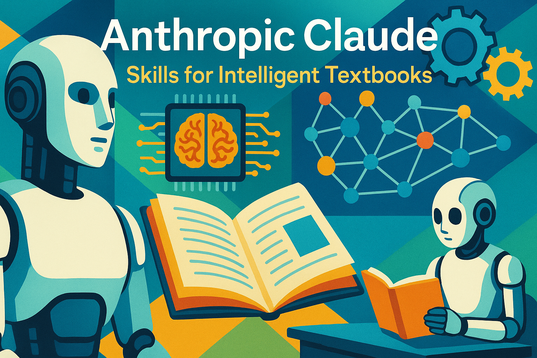

# Claude Skills for Intelligent Textbooks

Welcome to our website about Anthropic Claude Skills for Intelligent Textbooks.

In this course, a [Skill](./glossary.md#claude-skill) is a cleverly designed package of instructions that
are designed to be followed by intelligent agents as they help humans
design fun, interactive and engaging [Intelligent Textbooks](./glossary.md#intelligent-textbook).

These skills are designed to help teachers and textbook authors 
generate high-quality content including MicroSims for Intelligent Textbooks.

There are three key section.

1. [Getting Started](./getting-started.md) - This section describes how to install these skills on a Mac, Windows or UNIX system including how to install a skill for all your projects or just a single project.
2. [Chapters](./chapters/index.md) - 13 chapters about using skills to create intelligent textbooks
2. [List of Skills](./list-of-skills.md) - This is a list of the skills we have created to support
intelligent textbooks.  It includes skills for things such as:

    1. Setting up a book structure on GitHub
    2. Generating a high-quality course descriptions
    3. Generating a learning graph
    4. Generating chapter content
    5. Generating tables, charts, maps and timelines
    6. Generating interactive info-graphics
    7. Generating MicroSims
    8. Generating a Glossary of Terms
    9. Generating FAQs
    10. Generating Quizzes and Assessments
    11. Adding experience API (xAPI) to your interactive elements
    12. Send out announcements when your book is ready

Many of these skill are interactive and will ask you questions before they generate content in your book.

Most of the skills are currently targeting level-2 textbooks.
Some of the skill support the creation of xAPI and LRS features in level-2 textbooks.

Please contact me on [LinkedIn](https://www.linkedin.com/in/danmccreary/) if you have any questions.

Thanks! - Dan

