# Mermaid Flowchart Syntax Reference

This reference guide covers Mermaid flowchart syntax for generating interactive workflow diagrams.

## Basic Structure

Every Mermaid flowchart starts with a direction declaration:

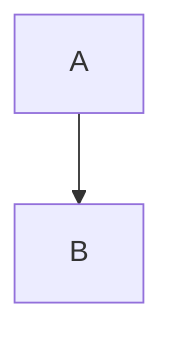

## Direction Options

Control flowchart orientation:
- **TD** or **TB**: Top to bottom (default for this skill)
- **BT**: Bottom to top
- **LR**: Left to right
- **RL**: Right to left

## Node Shapes

Mermaid supports various node shapes for different purposes:

| Shape | Syntax | Best For |
|-------|--------|----------|
| Rectangle | `A["Label"]` | Process steps, actions |
| Rounded Rectangle | `A("Label")` | Start/end points |
| Diamond | `A{"Decision?"}` | Decision points |
| Circle | `A(("Label"))` | Connectors, junctions |
| Stadium | `A(["Label"])` | Subroutines |
| Hexagon | `A{{"Label"}}` | Preparation steps |
| Parallelogram | `A[/"Input/Output"/]` | Data input/output |
| Trapezoid | `A[\"Process"\]` | Manual operations |

**Examples:**

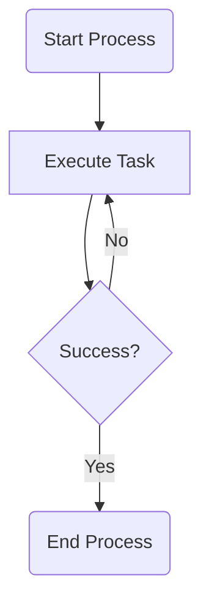

## Edges and Arrows

Connect nodes with various edge types:

| Type | Syntax | Use Case |
|------|--------|----------|
| Arrow | `A --> B` | Standard flow |
| Line (no arrow) | `A --- B` | Connection without direction |
| Dotted arrow | `A -.-> B` | Optional or conditional flow |
| Thick arrow | `A ==> B` | Primary/emphasized flow |
| Arrow with text | `A -->|Label| B` | Labeled transition |

**Edge Label Syntax:**

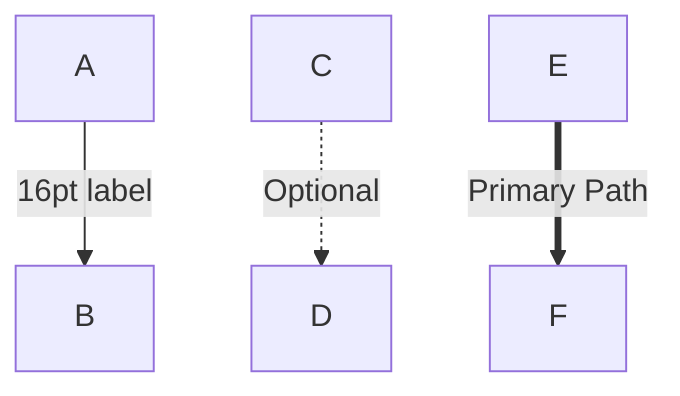

## Styling Nodes

Apply colors and formatting to individual nodes:

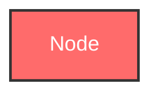

**Common Style Properties:**
- `fill`: Background color (hex or CSS color name)
- `stroke`: Border color
- `stroke-width`: Border thickness (pixels)
- `color`: Text color
- `font-size`: Font size (16px recommended for this skill)

## Class-Based Styling

Define reusable style classes for consistent theming:

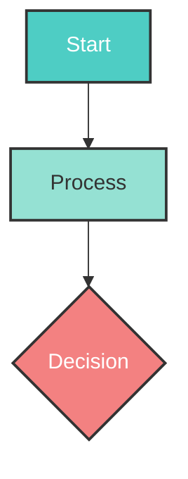

## Styling Edges

Style links (edges) by their index:

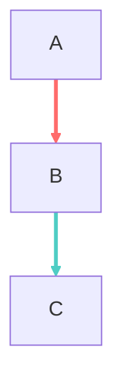

**Note:** Links are indexed starting from 0 in the order they appear.

## Subgraphs

Group related nodes into subgraphs:

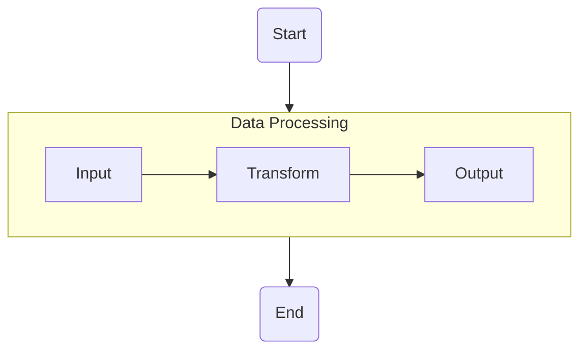

## Colorful Workflow Example

Here's a complete example with colorful backgrounds and 16pt fonts:

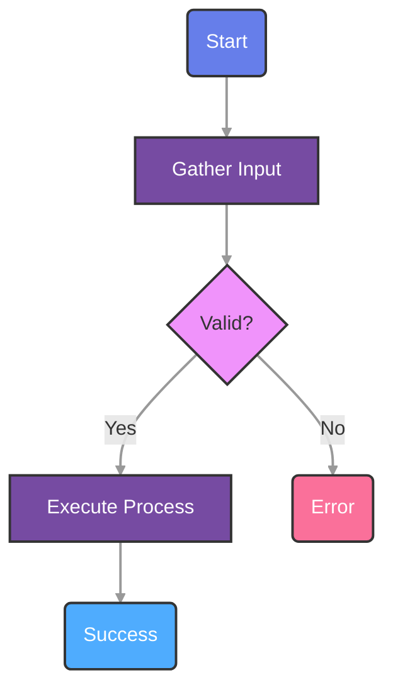

## Recommended Color Palettes

**Vibrant Palette:**
- Start/End: `#667eea` (purple-blue)
- Process: `#764ba2` (deep purple)
- Decision: `#f093fb` (pink)
- Success: `#4facfe` (light blue)
- Error: `#fa709a` (coral pink)

**Professional Palette:**
- Start/End: `#4ecdc4` (turquoise)
- Process: `#95e1d3` (mint)
- Decision: `#f38181` (coral)
- Success: `#6c5ce7` (purple)
- Error: `#ff7675` (red)

**Ocean Palette:**
- Start/End: `#0083b0` (ocean blue)
- Process: `#00b4d8` (sky blue)
- Decision: `#90e0ef` (light blue)
- Success: `#48cae4` (cyan)
- Error: `#0077b6` (deep blue)

## Best Practices

1. **Font Size**: Always use 16px font size for labels and edges for optimal readability
2. **Color Contrast**: Ensure text color contrasts well with background (use `color:#fff` for dark backgrounds, `color:#333` for light backgrounds)
3. **Consistent Styling**: Use class definitions for consistent appearance across similar nodes
4. **Edge Labels**: Keep edge labels concise (1-3 words) at 16pt
5. **Node Labels**: Use Title Case for node labels
6. **Direction**: Default to TD (top-down) unless horizontal flow is more intuitive
7. **Stroke Width**: Use 2-3px stroke width for clear node borders

## Common Patterns

**Linear Workflow:**
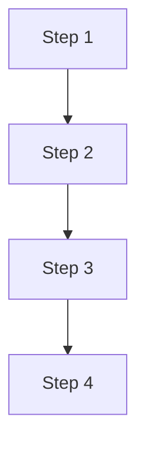

**Branching Decision:**
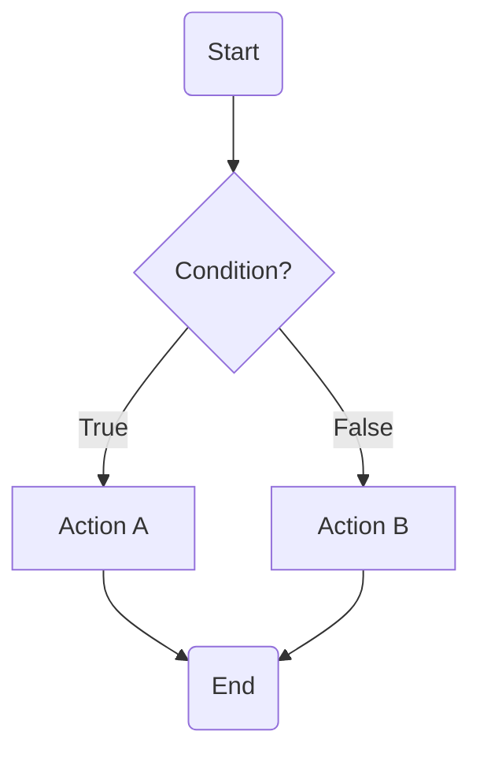

**Loop Pattern:**
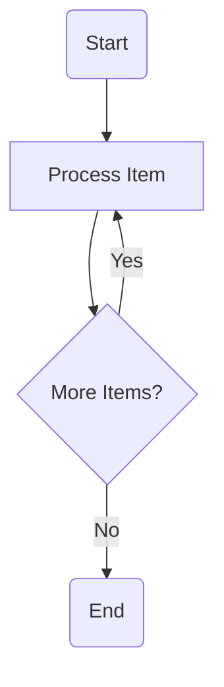

**Parallel Processing:**
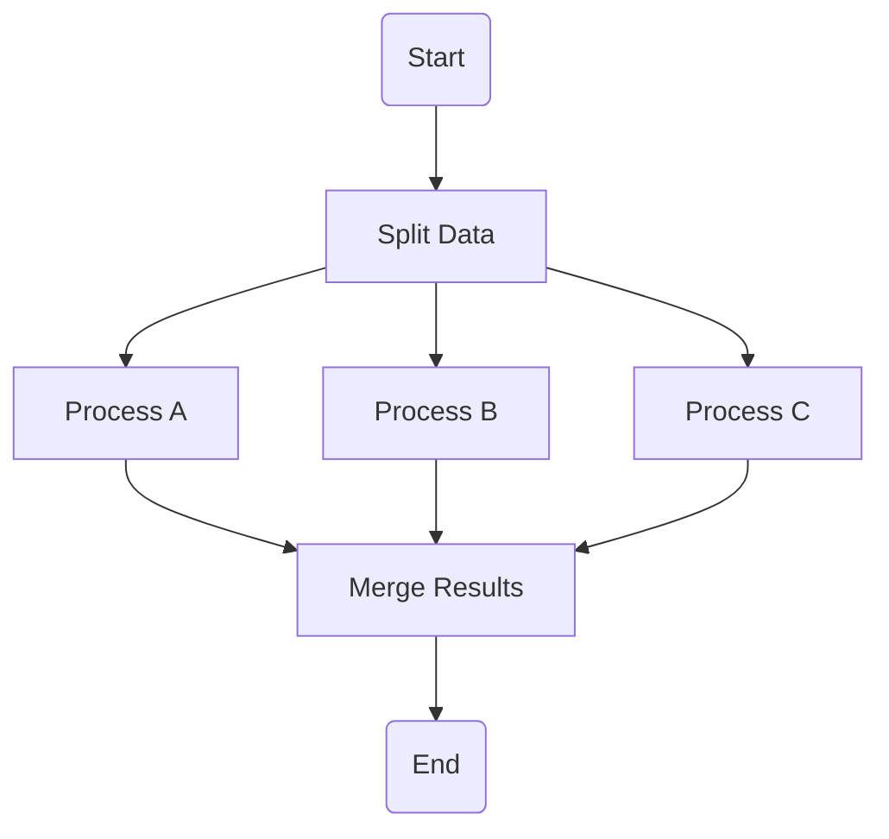

## Interactive Features

Add click handlers or hyperlinks to nodes:

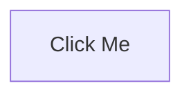

## Comments

Add comments for documentation:

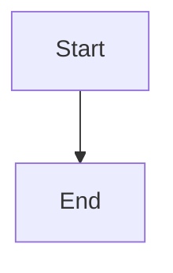

## Text Formatting

Use markdown within labels:

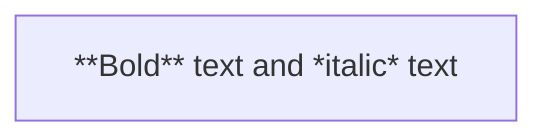

## Special Characters

Escape special characters in labels using quotes:

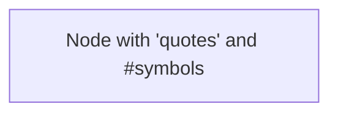
